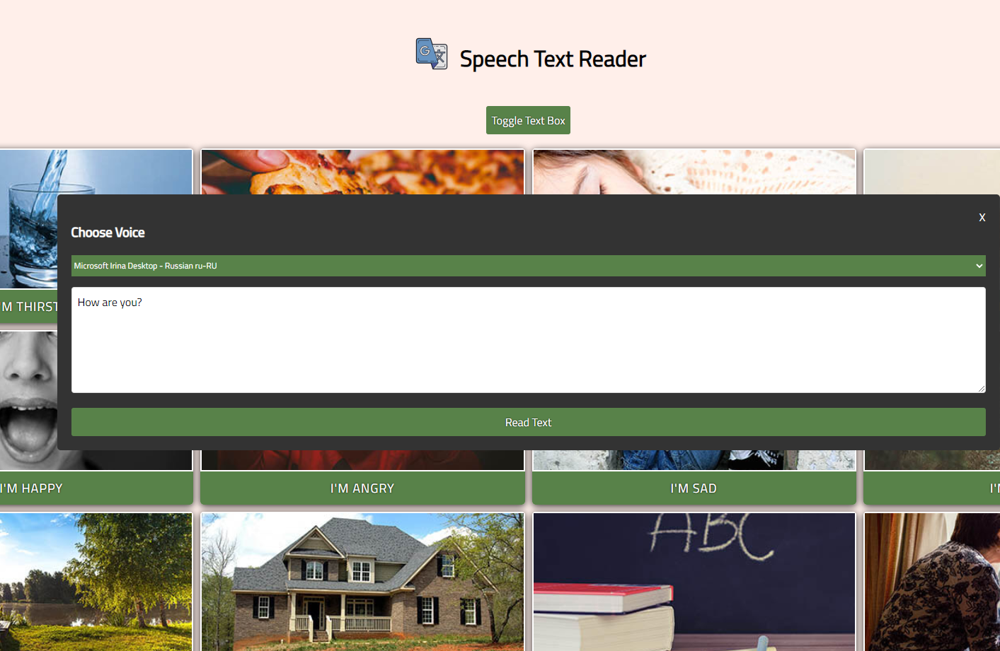

# Speech Text Reader

> A text to speech app for non-verbal people. Pre-made buttons and custom text speech. This project uses the Web Speech API

### [Demo](http://text-speech-reader.surge.sh)
[](https://radikal.ru/video/l9drNIghfA5)

### Get started

```shell script
git clone
```
```shell script
open index.html
```
or
```shell script
npm i -g live-server
```
```shell script
live-server
```